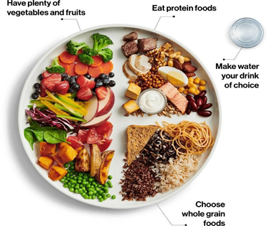

import Callout from 'nextra-theme-docs/callout'

## Como combinar as refeições

- **60% vegetais, legumes**

- **20% proteínas e gorduras boas**

- **20% carbohidratos**

| **Proibido consumir – Nunca** | **Evitar consumir – 1x a cada 2 semanas se estritamente necessário** | **Com moderação – 1x por semana se necessário** |
| --- | --- | --- |
| Frituras, fast food | Produtos industrializados (sobretudo enlatados) | |
| Sumos e refrigerantes | Sumos e refrigerantes diet | Sumos de frutas naturais |
| Farinhas e açúcar processados (pão, bolo, bolachas, biscoitos, pizza, empadões) | Açúcar artificial (sacarina) | Xylitol. Eritritol, Stevea, açúcar de coco, açúcar mascavo |
| Óleo de cozinha (hidrogenado) | | Óleo de côco |
| Carnes processadas (bacon, chouriço, hambúrguer, salsicha) | Carnes de vaca, porco, cabrito, camarão | Frango, perú, ganso, peixe, lulas, ameijoas, carangueijo |

# Exemplo

| P. almoço | Lanche da manhã | Almoço | Lanche da tarde | Jantar |
| --- | --- | --- | --- | --- |
| Papa de aveia com leite vegetal ou água Acrescentar **¹** : sementes | 1 Peça de fruta da época, mais uma mão de mix de castanhas de cajú ou mix de amêndoas e nozes | Arroz de lentilhas e salada de alface | Salada de fruta 1 taça de iogurte natural com um fio de mel | O mesmo que o almoço |
| Papa de aveia com leite vegetal ou água Acrescentar **¹** : sementes | 1 Peça de fruta | Massa integral refogada com vegetais e salada de ervilhas | Pipocas salgadas | O mesmo que o almoço |
| Panquecas de aveia e banana, e salada de fruta | 1 mão de castanhas de cajú, tiras de cenoura e pepino | Salada de feijão, batatinha e legumes assados | 1 mão de castanhas de cajú, tiras de cenoura e pepino, 1 peça de fruta | O mesmo que o almoço |
| Salada de fruta 1 taça de iogurte natural com um fio de mel | Amendoim torrado ou cozido com pouco sal | Puré de abóbora, peixe serra assado e legumes | 2 maçãs com casca ou 1 maçã grande | Sopa de abóbora com lentilhas |
| Papa de aveia com leite vegetal ou água Acrescentar **¹** : sementes | Batido ou smoothie a gosto | Guisado de grãode-bico + arroz integral, salada de vegetais | Panquecas de castanha de cajú e um fio de mel | O mesmo que o almoço |
| Panquecas de aveia e banana | Doce de batata doce com côco | Caril de lentilhas, puré de batata, salada de legumes | 1 peça de fruta 1 mão de castanhas de cajú | O mesmo que o almoço |
| Papa de aveia com leite vegetal ou água Acrescentar **¹** : sementes | Batido ou smoothie a gosto | Feijão preto, salada de couve, arroz integral | Salada de frutas, | O mesmo que o jantar. |

¹Acrescentar: para as sementes de linhaça, a quantidade ideal para hipertensos é de ¼ de chávena por dia, e as restantes sementes usa-se 1 colher de sopa.

²Arroz de lentilhas faz se como qualquer arroz refogado. A base é a cebola, pode acrescentar cenoura, repolho, pimentos, azeitonas, salsa, coentro, segundo a preferência.

³Ao usar o termo vegetais como salada ou para caracterizar algum prato refiro- me a : repolho, feijão verde, cenoura, couve flor, brócolis, cheiro verde.